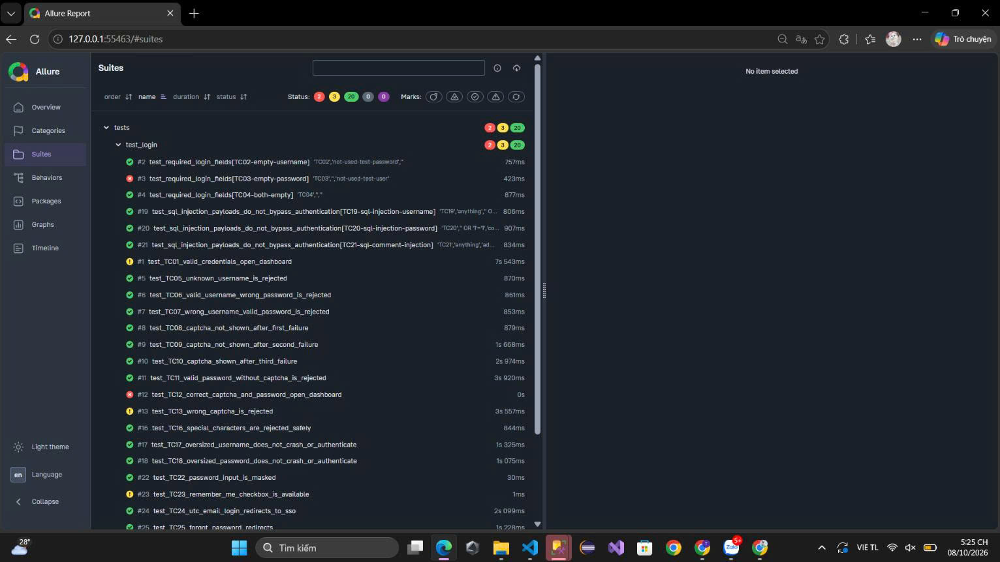

# Selenium E2E Test — Đăng nhập UTC

Bộ kiểm thử tự động giao diện đăng nhập Văn phòng điện tử UTC, xây dựng bằng
**Python**, **Selenium WebDriver**, **pytest** và **Allure Report**.

- **Trang kiểm thử:** [vanphongdientu.utc.edu.vn/Login](https://vanphongdientu.utc.edu.vn/Login)
- **Nguồn testcase:** `Test_Case_Trang_Dang_Nhap_UTC.xlsx`
- **Phạm vi:** 25 testcase, từ TC01 đến TC25

> **Lưu ý:** Website đích là hệ thống thật. Một số testcase gửi thông tin đăng
> nhập sai nhiều lần, có thể kích hoạt CAPTCHA hoặc khóa tài khoản. Chỉ chạy
> các testcase xác thực khi được phép và nên dùng tài khoản/môi trường dành
> riêng cho kiểm thử.

## Cấu trúc dự án

```text
base/
└── base_test.py       # Cấu hình và khởi tạo WebDriver
pages/
├── base_page.py       # Thao tác và cơ chế chờ dùng chung
└── login_page.py      # Page Object cho trang đăng nhập UTC
tests/
├── conftest.py        # Fixture pytest và metadata Allure
└── test_login.py      # 25 kịch bản kiểm thử
```

## Yêu cầu

- Python 3.10 trở lên
- Google Chrome (mặc định), Microsoft Edge hoặc Firefox
- Node.js và Java nếu muốn tạo/xem báo cáo Allure

Selenium Manager tự tìm hoặc tải WebDriver tương ứng khi chạy.

## Cài đặt

Mở PowerShell tại thư mục dự án:

```powershell
py -m venv .venv
.\.venv\Scripts\Activate.ps1
python -m pip install -r requirements.txt
```

## Chạy kiểm thử

Chạy toàn bộ 25 testcase:

```powershell
python -m pytest
```

Chạy một testcase cụ thể, ví dụ kiểm tra mật khẩu được che:

```powershell
python -m pytest -v tests/test_login.py::test_TC22_password_input_is_masked
```

Chạy các testcase chỉ kiểm tra giao diện/điều hướng, không cần đăng nhập thành
công:

```powershell
python -m pytest -v `
  tests/test_login.py::test_required_login_fields `
  tests/test_login.py::test_TC22_password_input_is_masked `
  tests/test_login.py::test_TC24_utc_email_login_redirects_to_sso `
  tests/test_login.py::test_TC25_forgot_password_redirects
```

Mặc định, username mẫu là `huongnt` và mật khẩu mẫu là `123456@utc`. Có thể
ghi đè cấu hình trong PowerShell trước khi chạy:

```powershell
$env:UTC_LOGIN_USERNAME = "tai-khoan-kiem-thu"
$env:UTC_LOGIN_PASSWORD = "mat-khau-kiem-thu"
python -m pytest
```

## Xem Allure Report

Mỗi lần chạy pytest, kết quả Allure được tạo mới trong thư mục
`allure-results`. Để tạo report và mở trên trình duyệt:

```powershell
npx --yes allure-commandline serve allure-results
```

Lệnh này yêu cầu Node.js và Java. Nếu muốn tạo báo cáo HTML để mở lại sau:

```powershell
npx --yes allure-commandline generate allure-results --clean -o allure-report
npx --yes allure-commandline open allure-report
```

Report hiển thị trạng thái từng testcase, thời gian chạy, nhóm tính năng
**UTC Login** và mã testcase. Khi test thất bại, ảnh chụp màn hình sẽ được
đính kèm nếu WebDriver vẫn hoạt động.

### Ảnh minh họa



## Cấu hình tùy chọn

Các biến môi trường sau cho phép thay URL, locator hoặc trình duyệt mà không
cần sửa mã nguồn:

| Biến | Mặc định | Mục đích |
| --- | --- | --- |
| `UTC_LOGIN_URL` | `https://vanphongdientu.utc.edu.vn/Login` | URL trang đăng nhập |
| `UTC_LOGIN_USERNAME` | `huongnt` | Username kiểm thử |
| `UTC_LOGIN_PASSWORD` | `123456@utc` | Mật khẩu kiểm thử |
| `UTC_LOGIN_CAPTCHA_ANSWER` | Để trống | Đáp án CAPTCHA cho TC12 |
| `UTC_LOGIN_BROWSER` | `chrome` | Trình duyệt: `chrome`, `edge` hoặc `firefox` |
| `UTC_LOGIN_HEADLESS` | `false` | Đặt `true` để chạy ẩn trình duyệt |
| `UTC_LOGIN_TIMEOUT` | `10` | Thời gian chờ Selenium, tính bằng giây |
| `UTC_LOGIN_USERNAME_SELECTOR` | `input[name='username'], input[name='email'], #username` | Locator ô username |
| `UTC_LOGIN_PASSWORD_SELECTOR` | `input[name='userpwd'], #password` | Locator ô mật khẩu |
| `UTC_LOGIN_SUBMIT_SELECTOR` | `button[type='submit'], input[type='submit']` | Locator nút đăng nhập |
| `UTC_LOGIN_CAPTCHA_SELECTOR` | `input[name='captcha'], input[name='captchaCode'], #captcha` | Locator ô CAPTCHA |
| `UTC_LOGIN_REMEMBER_SELECTOR` | `input[name='persistent'], input[name='remember'], #persistent` | Locator “Ghi nhớ tôi” |
| `UTC_LOGIN_ERROR_SELECTOR` | `[role='alert'], .error, .alert-danger, .invalid-feedback` | Locator thông báo lỗi |
| `UTC_LOGIN_SUCCESS_URL_CONTAINS` | `dashboard` | Một phần URL sau đăng nhập thành công |
| `UTC_LOGIN_SUCCESS_SELECTOR` | Để trống | CSS selector phần tử xác nhận đăng nhập thành công |
| `UTC_LOGIN_SSO_URL_CONTAINS` | `accounts.google.com` | Kiểm tra URL đích SSO |
| `UTC_LOGIN_FORGOT_URL_CONTAINS` | `getpass` | Kiểm tra URL trang quên mật khẩu |

Locator liên kết SSO và quên mật khẩu cũng có thể thay đổi qua
`UTC_LOGIN_SSO_LINK_XPATH` và `UTC_LOGIN_FORGOT_LINK_XPATH`.

Với testcase cần tài khoản hợp lệ riêng, có thể đặt biến như
`UTC_LOGIN_USERNAME_TC06` hoặc `UTC_LOGIN_USERNAME_TC08`; nếu không, testcase
sẽ dùng `UTC_LOGIN_USERNAME`. Các testcase CAPTCHA TC08–TC13 dùng chung bộ
đếm đăng nhập sai phía máy chủ, vì vậy cần tài khoản kiểm thử riêng hoặc đặt
lại bộ đếm giữa các lần chạy.

## File kết quả và Git

Các thư mục `allure-results/` và `allure-report/` là kết quả phát sinh, đã
được loại khỏi Git bằng `.gitignore`. File ảnh minh họa report được lưu tại
`AllureReport.jpg`.
